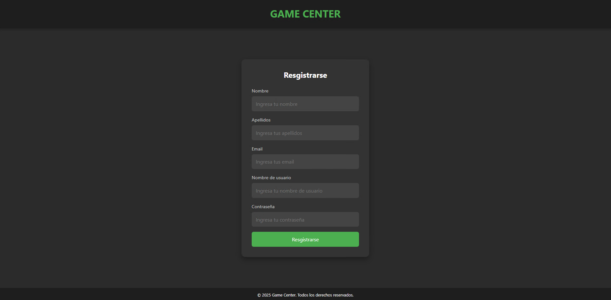
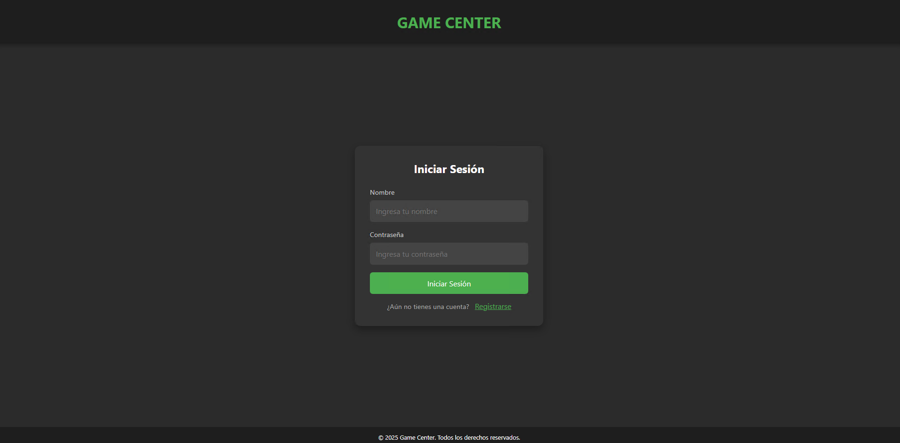
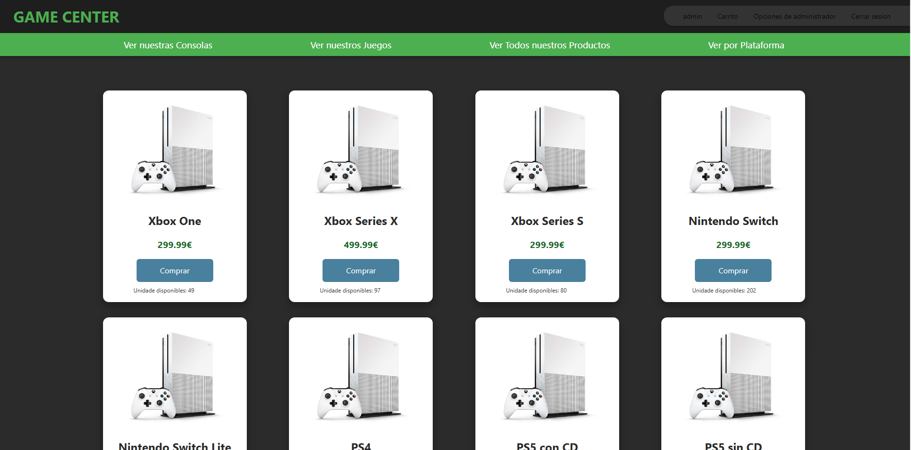
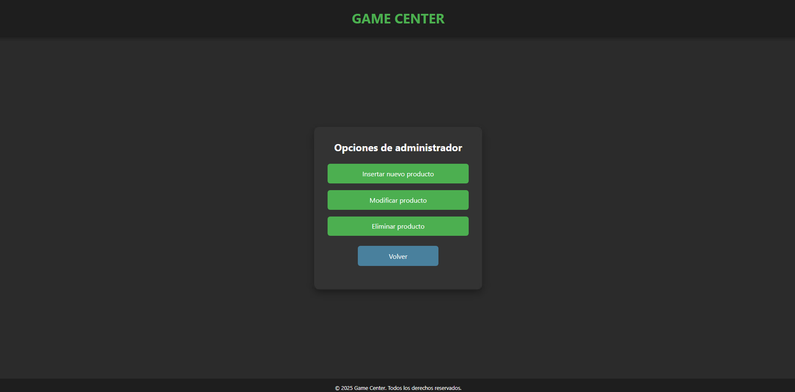
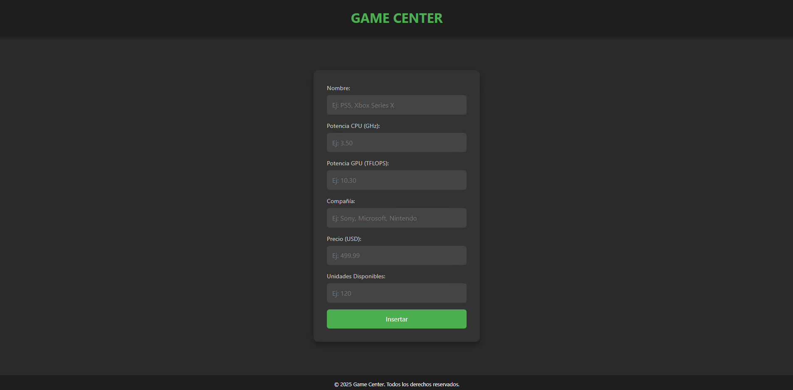
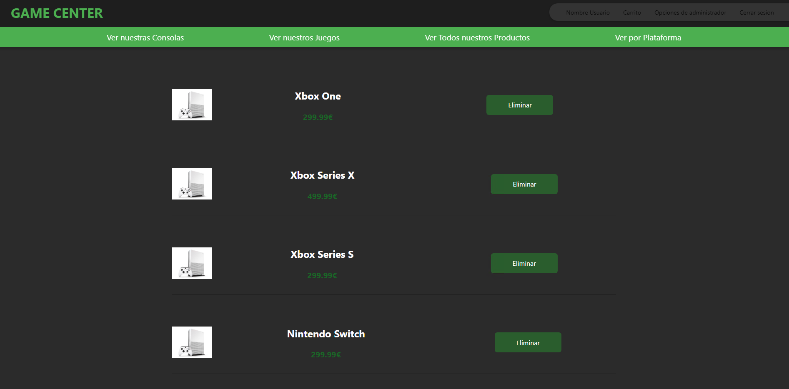

# 🎮 Game Center

¡Bienvenido/a! Este repositorio contiene una aplicación web desarrollada en **Java Servlets** y **JSP** para gestionar el stock de una tienda de videojuegos. El proyecto ha sido encargado por **Centro Game** y desarrollado como práctica del módulo **Despliegue de Aplicaciones Web** en el I.E.S. DOMENICO SCARLATTI.

---

## ✨ Descripción del Proyecto

Esta aplicación permite gestionar de manera eficiente el inventario de una tienda de videojuegos que dispone de consolas y un catálogo de juegos para cada una de ellas. Además, proporciona funcionalidades para consultar, comprar y administrar los productos disponibles.

### 🕹️ Consolas Disponibles:
- Xbox One
- Xbox Series X
- Xbox Series S
- Nintendo Switch
- Nintendo Switch Lite
- PS4
- PS5 con CD
- PS5 sin CD

### 📚 Funcionalidades Clave:
1. **Consulta de Consolas**:
   - Potencia de la CPU y GPU
   - Compañía fabricante
   - Precio
   - Unidades disponibles

2. **Consulta de Juegos**:
   - Catálogo por consola con:
     - Nombre del juego
     - Compañía desarrolladora
     - Género
     - Puntuación en Metacritic
     - Precio
     - Unidades disponibles
   - Catálogo total de la tienda (todos los juegos de todas las consolas)

3. **Consulta de Productos**:
   - Nombre del producto
   - Precio
   - Unidades disponibles

4. **Compra de Productos**:
   - Disminuye el stock de productos (solo si hay unidades disponibles).

5. **Gestión de Stock (Solo Administradores)**:
   - Modificación de información de productos existentes.
   - Inserción de nuevos productos.
   - Eliminación de productos.

---

## 🛠️ Tecnologías Utilizadas

- **Frontend**:
  - HTML5
  - CSS3
- **Backend**:
  - Java (Servlets y JSP)
- **Base de Datos**:
  - MySQL
- **Servidor de Aplicaciones**:
  - Apache Tomcat

---

## 🚀 Requisitos para la Ejecución

### 📦 Dependencias:
1. **Java JDK 8 o superior**.
2. **Apache Tomcat 9 o superior**.
3. **MySQL**.
4. **IDE para ejecutar el código**.

### 🔧 Configuración:
1. **Clona el repositorio**:
   ```bash
   git clone https://github.com/DannaPatricia/game-center.git
   cd game-center
2. **Configura la base de datos**: Crea una base de datos en MySQL e importa el script SQL proporcionado en game_center.sql para crear las tablas necesarias.
3. **Configura el archivo web.xml**: Modifica las credenciales de acceso a la base de datos según tu entorno en el archivo WEB-INF/web.xml.
4. **Accede a la aplicación**: Abre tu navegador y dirígete a: http://localhost:8080/gestion-stock-videojuegos.

   ---

##  📦 Funcionalidades Principales🛒
1. **Pantalla Principal**: Acceso a las distintas secciones (consultar consolas, juegos, productos).
2. **Login de Administrador**: Solo los administradores pueden acceder a las funciones de gestión de stock.
3. **Gestión de Productos**: Añade, edita o elimina productos del catálogo.
4.  **Proceso de Compra**: Disminuye automáticamente el stock de productos adquiridos.

 ---

 ##🖼️ Capturas de Pantalla
 1. **Registro y login**:

<div align = "center">
   
</div>
<div align = "center">
   
</div>

 2. **Registro y login**:
 

 3. **Opdiones de administrador**:
 

 4. **Formularios de modificar e insertar producto**:
 
 

 5. **Listado de modificar y eliminar producto**:
 
 

 ---

 ### Próximos Pasos

- **Mejoras en el código:** Añadir un carrito para cada usuario.
- **Mejoras en la interfaz:** Añadir una imagen por consola y por juegos por consola desde la base de datos.

---

 ## 🤝 Contribuciones

1. Haz un fork del repositorio.
2. Crea una rama para tu funcionalidad:
   ```bash
    git checkout -b mejora-nueva-funcion
3. Realiza los cambios y haz commmit:
   ```bash
   git commit -m "Añadida nueva función X"
4. Haz push a tu rama:
   ```bash
    git push origin mejora-nueva-funcion
5. Crea un pull request desde GitHub.

---
¡Gracias por tu interés en este proyecto! 🚀

---

## Licencia

Este proyecto está bajo la **Licencia MIT**. Puedes ver el texto completo de la licencia a continuación:

---

MIT License

Copyright (c) [año] [Tu nombre o el de tu organización]

Se concede permiso, de forma gratuita, a cualquier persona que obtenga una copia de este software y los archivos asociados, para utilizarlo sin restricciones, incluyendo sin limitación los derechos de usar, copiar, modificar, fusionar, publicar, distribuir, sublicenciar y/o vender copias del software, y permitir a las personas a las que se les proporcione hacerlo, sujeto a las siguientes condiciones:

El aviso de copyright y este aviso de permiso deberán incluirse en todas las copias o partes sustanciales del software.

EL SOFTWARE SE PROPORCIONA "TAL CUAL", SIN GARANTÍA DE NINGÚN TIPO, EXPRESA O IMPLÍCITA, INCLUYENDO PERO NO LIMITÁNDOSE A LAS GARANTÍAS DE COMERCIABILIDAD, APTITUD PARA UN FIN PARTICULAR Y NO INFRACCIÓN. EN NINGÚN CASO LOS AUTORES O TITULARES DEL COPYRIGHT SERÁN RESPONSABLES POR CUALQUIER RECLAMO, DAÑO O CUALQUIER OTRA RESPONSABILIDAD, YA SEA EN UNA ACCIÓN DE CONTRATO, AGRAVIO O DE CUALQUIER OTRA FORMA, QUE SURJA DE O EN CONEXIÓN CON EL SOFTWARE O EL USO O CUALQUIER OTRO TIPO DE ACCIONES EN EL SOFTWARE.

 

